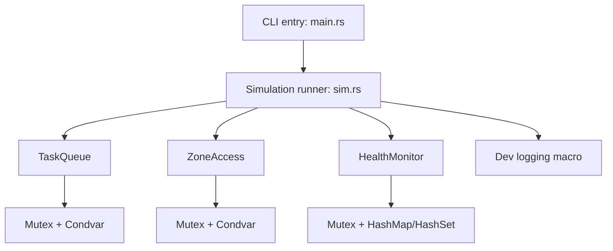
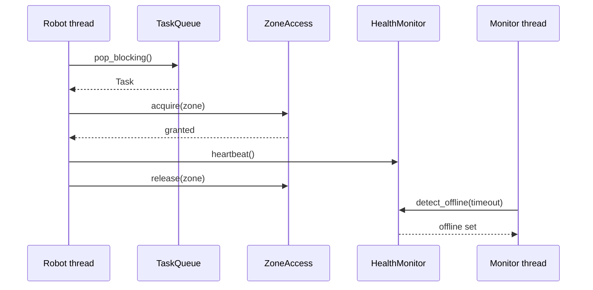
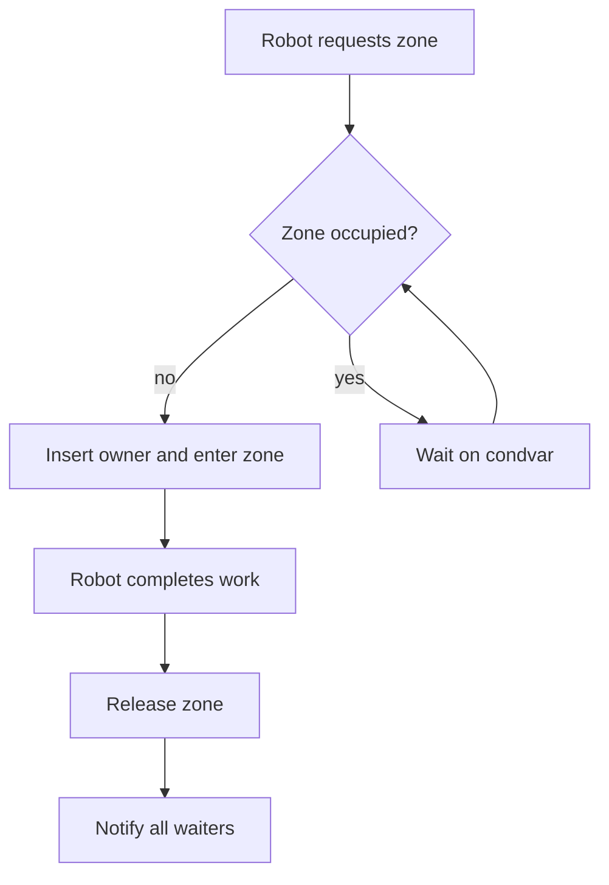

# Project Blaze Diagrams

The diagrams below are written in Mermaid for easy rendering in Markdown viewers
that support it (GitHub, GitLab, many IDEs).

## High-level architecture

## Robot task flow + monitoring

## Zone access control logic

